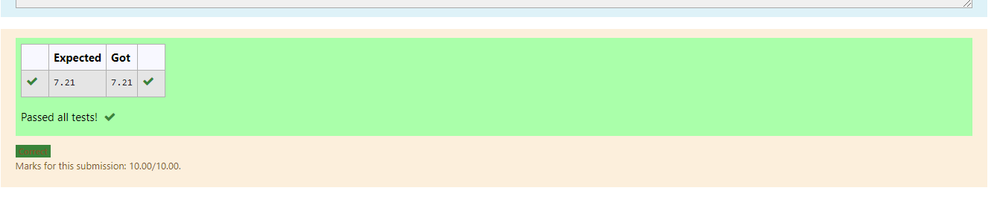

# DISTANCE-BETWEEN-TWO-POINTS

## AIM:
To write a python program to find the distance two 2 points
## ALGORITHM:
### Step 1: 
Import math into the program.
### Step 2: 
input x,y to calculate the distance between cordinates
### Step 3: 
Substitute the values in the distance formula  
### Step 4: 
print the program.
### Step 5:
end the program 
### PROGRAM:
```
#Program to find the distance between two points.
#Developed by: A.JEEVA ABISHAKE
#RegisterNumber:21500568
import math
x=[10,6]
y=[4,2]
dist=math.sqrt(((x[0]-x[1])**2)+((y[0]+y[1])**2))
print("{:.2f}".format(dist))
```
### OUTPUT:



### RESULT:
Thus program executed.
